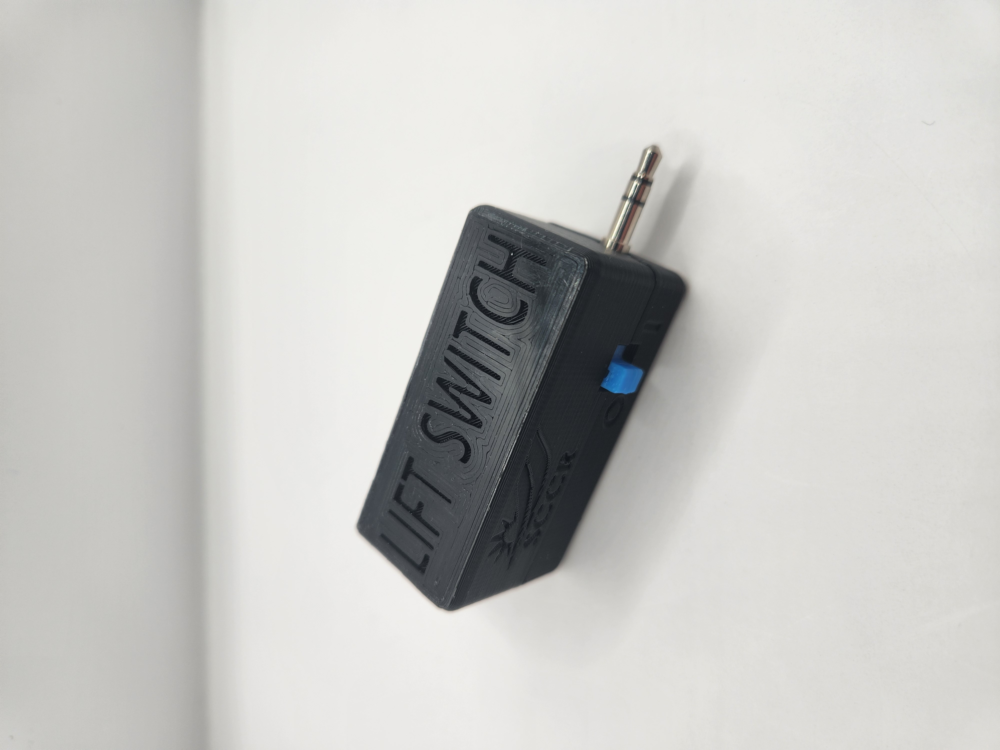

<!---  Open Source Assistive Technology: GitHub Readme Template Version 1.1 (2024-Mar-15)  --->

<!-- TITLE --->
# Lift Switch
<!--- SUMMARY -->
<!-- A brief summary of the project. What it does, who it is for, how much it costs. -->
The Lift Switch is a device that modifies the output from your assistive switch. The primary case is for a user who would prefer to rest on their switch and lift off of it to activate it, instead of requiring the user to hover over the switch. There are four operating modes: momentary, latching, timed latch, and reverse acting, described below:
- Momentary: The output will turn on momentarily when you lift off of the assistive switch.
- Latching: The output toggles between on/off when you lift off of the assistive switch.
- Timed Latch: The output will turn on for a set amount of time (7s) when you lift off of the assistive switch.
- Reverse Acting: Reverses the action of an assistive switch. Assistive switch off (not activated) = Lift Switch on, Assistive switch on (activated) = Lift Switch off.

The Lift Switch can also be used as a mouse click in any of the above modes, by plugging the Lift Switch into a computer through a USB cable.

The total cost of materials to build this device is around \$75 (plus component shipping). The cost of materials per unit is around \$43 (plus component shipping) if you are able to build in bulk.

## Makers Making Change Assistive Device Library Listing
- https://www.makersmakingchange.com/s/product/lift-switch/01tJR000003UiczYAC

## How to Obtain the Device
### 1. Do-it-Yourself (DIY) or Do-it-Together (DIT)

This is an open-source assistive technology, so anyone is free to build it. All of the files and instructions required to build the device are contained within this repository. Refer to the Maker Guide below.

### 2. Request a build of this device

You may also submit a build request through the [Makers Making Change Assistive Device Library Listing](https://www.makersmakingchange.com/s/product/lift-switch/01tJR000003UiczYAC) to have a volunteer maker build the device. As the requestor, you are responsible for reimbursing the maker for the cost of materials and any shipping.

### 3. Build this device for someone else

If you have the skills and equipment to build this device, and would like to donate your time to create the device for someone who needs it, visit the [MMC Maker Wanted](https://makersmakingchange.com/maker-wanted/) section.

## Build Instructions

### 1. Read through the Maker Guide

The [Maker Guide](/Documentation/Lift_Switch_Maker_Guide.pdf) contains all the necessary information to build this device, including tool lists, assembly instructions, programming instructions and testing.

### 2. Order the Off-The-Shelf Components

The [Bill of Materials](/Documentation/Lift_Switch_BOM.csv) lists all of the parts and components required to build the device.

### 3. Order the Custom PCB

This device requires a custom PCB. Instructions are provided in the [Maker Guide](/Documentation/Lift_Switch_Maker_Guide.pdf) and the PCB fabrication files are available in the [PCB Build Files](/Build_Files/PCB_Build_Files).

### 4. Print the 3D Printable components

All of the files and individual print files can be in the [/Build_Files/3D_Printing_Files](/Build_Files/3D_Printing_Files/) folder.

### 5. Assemble the Lift Switch

Reference the [Maker Guide](/Documentation/Lift_Switch_Maker_Guide.pdf) for the tools and steps required to build each portion.

## How to improve this Device
As open source assistive technology, you are welcomed and encouraged to improve upon the design. 

## Files
### Documentation
| Document             | Version | Link |
|----------------------|---------|------|
| Maker Guide          | 1.0     | [Lift_Switch_Maker_Guide](/Documentation/Lift_Switch_Maker_Guide.pdf)     |
| Bill of Materials    | 1.0     | [Lift_Switch_Bill_of_Materials](/Documentation/Lift_Switch_BOM.csv)     |
| User Guide           | 1.0     | [Lift_Switch_User_Guide](/Documentation/Lift_Switch_User_Guide.pdf)    |
| Changelog            | 1.0     | [Changelog](CHANGES.txt)     |

### Design Files
<!---
DESIGN FILES
Include a copy of the original design files to facilitate easy editing and customization. Consider also including a generic format (e.g., STEP)
--->
 - [CAD Files](/Design_Files/CAD_Design_Files)
 - [PCB Files](/Design_Files/PCB_Design_Files)

<!---
BUILD FILES
Include a copy of the build files intended for manufacturing. This may include svg files for laser cutting, stl files for 3d printing, Gerber files for custom PCBs, and Arduino files for custom firmware
--->
### Build Files
 - [3D Printing Files](/Build_Files/3D_Printing_Files)
 - [PCB Build Files](/Build_Files/PCB_Build_Files)
 - [Firmware Files](/Build_Files/Firmware_Files)

<!---
ATTRIBUTION
Provide any necessary attribution for designs or components that are included in the device or as part of the project.
--->
## Attribution

The Lift Switch was designed by the Rehabilitation Engineering Department at Horizon Health's Stan Cassidy Centre for Rehabilitation (SCCR). Development was supported through the Government of Canada's Innovation Science and Economic Development  [Accessible Technology Program](https://ised-isde.canada.ca/site/accessible-technology-program). The ATP program enabled SCCR to deploy numerous Lift Switches to users at reduced cost.

The latest design (V2.0) incorporates feedback and suggestions from numerous users, clinicians, and volunteer makers.

The latest design incorporates several commercially available open source hardware components from [Adafruit](https://www.adafruit.com/). The Lift Switch firmware utilizes the [Arduino](https://www.arduino.cc/) development platform, and a number of libraries developed and shared by the open source community.

<!---
This is the attribution for the template.
--->
The documentation template was created by Makers Making Change / Neil Squire Society and is used under a CC BY-SA 4.0 license. It is available at the following link: [https://github.com/makersmakingchange/OpenAT-Template](https://github.com/makersmakingchange/OpenAT-Template)

<!---
CONTRIBUTORS
List the names of the people that contributed to the design. This could include the original source of the idea, designers, testers, documenters, etc.
--->
### Contributors

- Rachelle Bernier, Horizon Health Network.
- Marla Calder, Horizon Health Network
- Natasha Hanson, Horizon Health Network
- Dorian Hawkes, Horizon Health Network
- Rick McCaskill, Horizon Health Network
- Billie O'Connor, Horizon Health Network
- Kristen Culberson, Horizon Health Network
- Josie Versloot, Neil Squire Society / Makers Making Change

<!---
LICENSE
Add the year(s) for the copyright and the Designer Name. You may use the standard set of open licenses or choose your own for the hardware, software, and accompanying materials.
--->
## License
Copyright (c) 2020-2024 Stan Cassidy Centre for Rehabilitation.

This repository describes Open Hardware:
 - Everything needed or used to design, make, test, or prepare the Lift Switch is licensed under the [CERN 2.0 Weakly Reciprocal license (CERN-OHL-W v2) or later](https://cern.ch/cern-ohl ) .
 - All software is under the [GNU General Public License v3.0 (GPL-3.0)](https://www.gnu.org/licenses/gpl.html).
 - Accompanying material such as instruction manuals, videos, and other copyrightable works that are useful but not necessary to design, make, test, or prepare the Lift Switch are published under a [Creative Commons Attribution-ShareAlike 4.0 license (CC BY-SA 4.0)](https://creativecommons.org/licenses/by-sa/4.0/) .

You may redistribute and modify this documentation and make products using it under the terms of the [CERN-OHL-W v2](https://cern.ch/cern-ohl).
This documentation is distributed WITHOUT ANY EXPRESS OR IMPLIED WARRANTY, INCLUDING OF MERCHANTABILITY, SATISFACTORY QUALITY AND FITNESS FOR A PARTICULAR PURPOSE.
Please see the CERN-OHL-W v2 for applicable conditions.

Source Location: https://github.com/makersmakingchange/Lift-Switch

----

<!-- ABOUT MMC START -->
## About Makers Making Change

Makers Making Change is a program of [Neil Squire](https://www.neilsquire.ca/), a Canadian non-profit that uses technology, knowledge, and passion to empower people with disabilities.

Makers Making Change leverages the capacity of community based Makers, Disability Professionals and Volunteers to develop and deliver affordable Open Source Assistive Technologies.

 - Website: [www.MakersMakingChange.com](https://www.makersmakingchange.com/)
 - GitHub: [makersmakingchange](https://github.com/makersmakingchange)
 - Bluesky: [@makersmakingchange.bsky.social](https://bsky.app/profile/makersmakingchange.bsky.social)
 - Instagram: [@makersmakingchange](https://www.instagram.com/makersmakingchange)
 - Facebook: [makersmakechange](https://www.facebook.com/makersmakechange)
 - LinkedIn: [Neil Squire Society](https://www.linkedin.com/company/neil-squire-society/)
 - Thingiverse: [makersmakingchange](https://www.thingiverse.com/makersmakingchange/about)
 - Printables: [MakersMakingChange](https://www.printables.com/@MakersMakingChange)

### Contact Us
For technical questions, to get involved, or to share your experience we encourage you to [visit our website](https://www.makersmakingchange.com/) or [contact us](https://www.makersmakingchange.com/s/contact).
<!-- ABOUT MMC END -->
